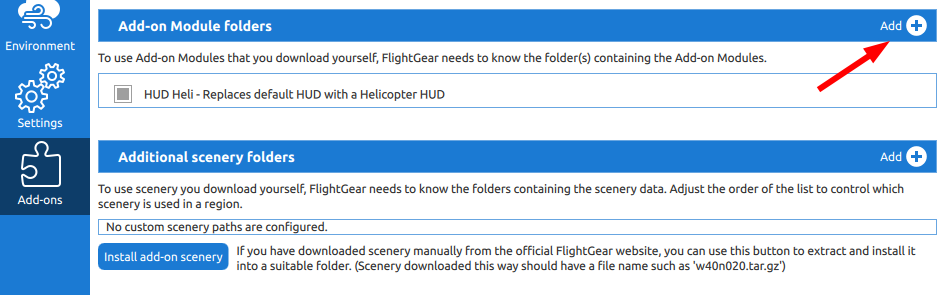

# About

Simple addon to enable new HUD for helicopter control. Especially useful is the
stick position interface. Encapsulation for add-on of HUD created by
http://wiki.beggabaur.rocks/ya/HeliHUD. Original source code with the latest
version is located in 'contrib' directory.

# Running

- extract zip (if downloaded as a zip) to a given location. For example let's
  say we have /myfolder/addons/thisaddon with contents of this addon.
- run flightgear with --addon directive **OR** add it in the Launcher application
  in 'Add-On' section.

Code:
```
    ./fgbin/bin/fgfs --fg-root=./fgdata --launcher --prop:/sim/fg-home=/myfolder/flightgear/fghome --addon="/myfolder/addons/thisaddon"
```




# Configuration

After starting up, it replaces default HUD (HUD order). When you press 'h' first
time the heli HUD appears. Pressing 'h' again will change HUD color. You can change
HUD's layout with 'I' button. Order of HUDS provided by the addon:

- HUD Heli
- HUD Lil (little)
- Default
- NTPS
- minimal

# History

- 0.0.1 - first beta version on github
- 0.0.2 - small documentation changes, include original source code

# Authors

- Slawek Mikula - addon source code and packaging
- Alex D-HUND - main source code

# Links

- http://wiki.beggabaur.rocks/ya/HeliHUD original code for HUD

# License

GNU General Public License version 2
